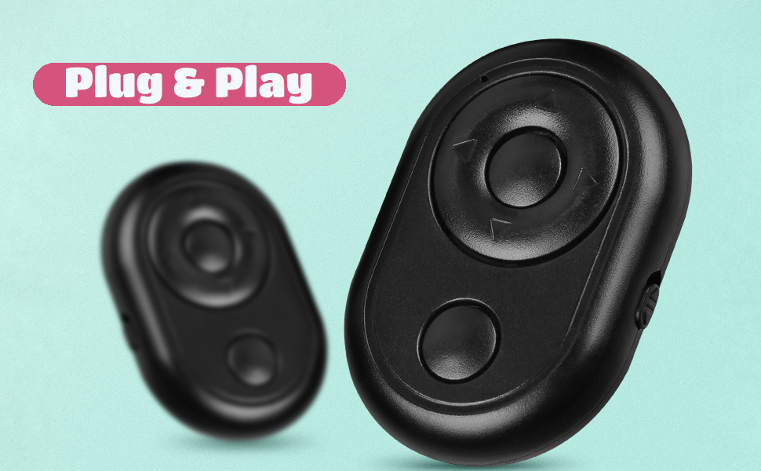

# Arduino bleM3Remote
This library is written for ESP32 Arduino projects to interact with the BLE-M3 remote. The remote has 6 buttons and goes for ~$1 on [AliExpress](https://www.aliexpress.com/item/1005005169621870.html). The library is built using the [NimBLE-Arduino](https://github.com/h2zero/NimBLE-Arduino) library. The ESP32 will act as a BLE client, with the remote as a BLE HID server.

# HID Button Press Capture
This BLE remote, much like other BLE remotes, emulates keyboard/mouse inputs. For example, the camera button emulates a volume up keypress. Some of the buttons emulate a sequence of inputs. Decoding each button press into its corresponding keyboard/mouse inputs would take a lot of code. Instead, a vector of 9 values that were found to be unique to each keypress was used to identify button presses. The button presses are captured as single presses. This library does not handle long presses.

# Reconnection After Sleep
The BLE-M3 remote goes into deep sleep after 10 minutes of inactivity. This allows the remote to last many months on a single CR2032 battery. Any button press will wake the device and the ESP32 will automatically reconnect to it. Currently it takes ~0.7 seconds to establish a reconnection from deep sleep. This means any button presses within that time will not be captured. This is not ideal. Other BLE devices (firestick remote, bluetooth mice, etc) accomplish this reconnection much faster. They don't seem to miss button presses either. Any ideas on how to improve this library's reconnect time will be greatly appreciated. 😄

# Multiple Connections
The library is written to handle multiple remotes connecting simultaneously. By default the max connections is set to 3. This can be changed by updating the **MAX_REMOTES**. The maximum BLE server connections the ESP32 can handle is something that can be found in the [NimBLE-Arduino](https://github.com/h2zero/NimBLE-Arduino) library.

# Simultaneous BLE Client and Server
The BLE-M3 is a BLE HID server. So this library makes your ESP32 a BLE client to connect with it. But you can simultaneously run your ESP32 as a BLE server and client depending on your project needs. To do that, initialize your BLE server code first, then run **initRemoteClient** with false (initRemoteClient(false)). An example will be included in the future.

# Install
download this repo and place it inside **Arduino/libraries**

# Examples
## simple
this is a simple example of using the library.

## customCallback
this example shows how to create your own button press callback

## whitelistMacs
this is a simple example that shows how to only allow specific mac address to connect. By default **macWhitelist** is empty and allows any mac address to connect.

# ESP32 Devices
The library has been tested to be working on ESP32-C3 and ESP32-S3 devices.